# Pertemuan 3 - Oprec Admin NCC 2024

## Daftar Isi
- [Websocket](#websocket)
    - [Pengertian websocket?](#pengertian-websocket)
    - [Perbandingan dengan REST API](#perbandingan-dengan-rest-api)
    - [Bagaimana koneksi websocket terbentuk?](#bagaimana-koneksi-websocket-terbentuk)
- [Membangun aplikasi chat realtime dengan socket.io](#membangun-aplikasi-chat-realtime-dengan-socket-io)
    - [Integrasi websocket](#integrasi-websocket)
    - [Menambah user](#menambah-user)
    - [Bergabung ke room dan mengirim pesan](#bergabung-ke-room-dan-mengirim-pesan)
- [Penugasan](#penugasan)

## Websocket
### Pengertian websocket
Websocket merupakan protokol komunikasi yang menyediakan saluran komunikasi 2 arah, full-duplex, melalui suatu koneksi TCP. Hal ini memungkinkan klien dan server untuk berkomunikasi secara real-time. Selain itu, komunikasi pada websocket bersifat event-driven sehingga memungkinkan interaksi yang fleksibel dan responsif. Protokol ini telah distandarisasi oleh IETF dan didefinisikan pada <a href="https://datatracker.ietf.org/doc/html/rfc6455">RFC 6455</a>.
Websocket biasa digunakan untuk fitur aplikasi yang memerlukan update data dari server secara real-time. Hal ini karena websocket memungkinkan klien dan server untuk melakukan komunikasi dua arah sehingga dapat berpengaruh pada kecepatan dan performa aplikasi. Berikut beberapa contoh aplikasi atau fitur yang dapat memanfaatkan websocket untuk mendukung komunikasi real-time:
1. Multiplayer game<br>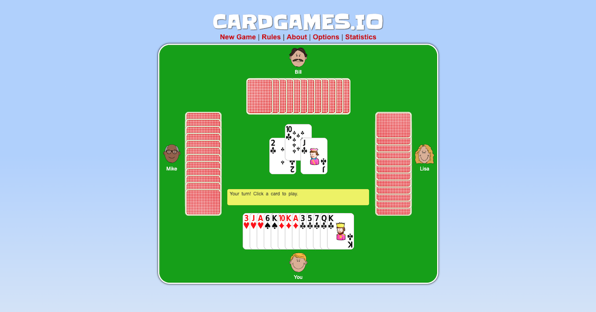
2. Aplikasi berkirim pesan<br>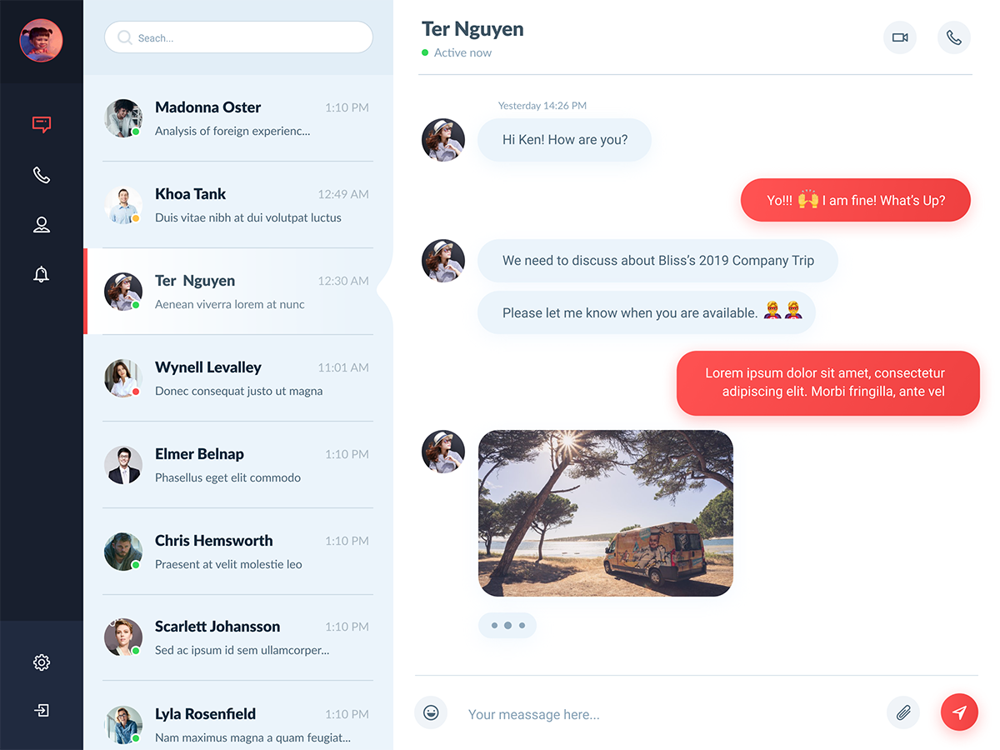
3. Collaborative editing tools (figma, canva, miro)<br>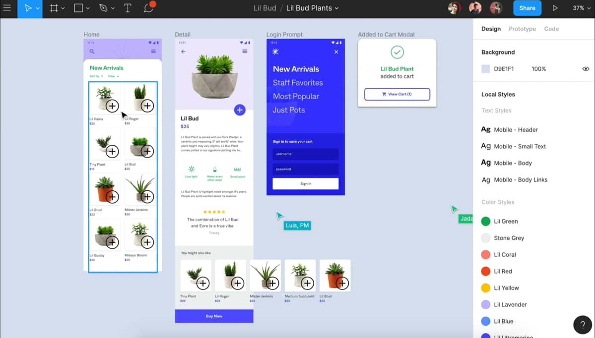
4. Platform voting real-time<br>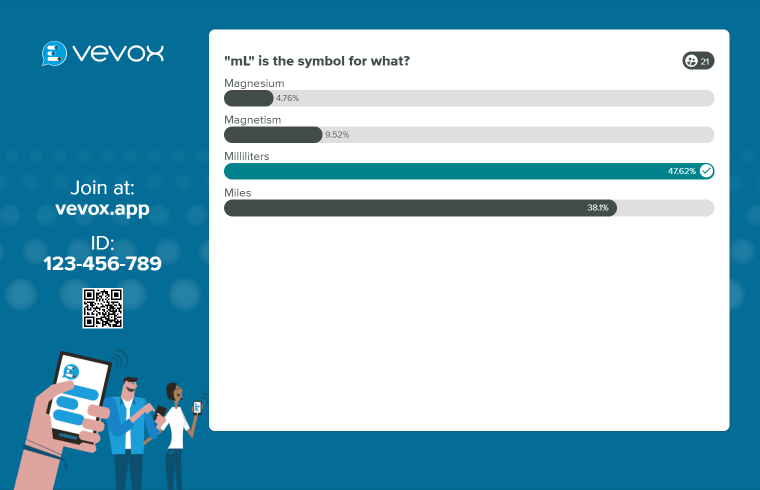 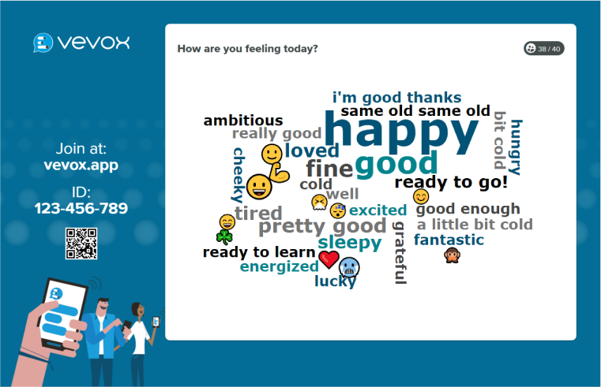

### Perbandingan dengan REST API
Pada pertemuan 2, kita telah mempelajari terkait apa itu REST API. Metode ini sangat sering digunakan ketika klien membutuhkan data atau resource yang ada pada server. Meski begitu, penggunaan REST API dapat tidak efektif pada beberapa kasus tertentu, terutama jika aplikasi membutuhkan pembaruan data secara real-time. Pada kasus tersebut, klien harus secara aktif melakukan request pada server untuk mendapatkan pembaruan data. Sedangkan dengan websocket, server dapat menginisiasi pengiriman data baru karena bentuk komunikasi websocket yang dua arah. Berikut contoh perbedaan websocket dan REST API dalam mengimplementasikan realtime chat application.<br>
<center>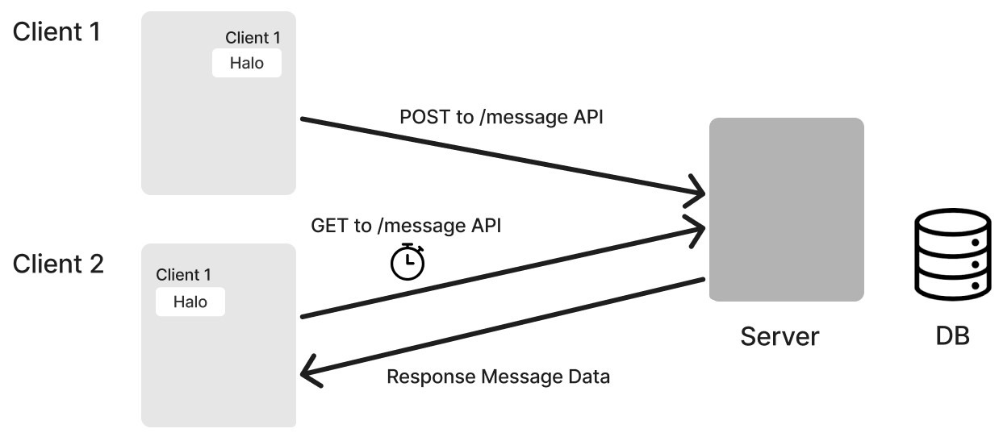</center><br>
Pada REST API, ketika client1 mengirimkan chat baru, client akan dengan melakukan POST REQUEST untuk mengirimkan data chat ke server. Selanjutnya, server akan menyimpan data tersebut di database. Agar client2 bisa mendapat data baru tersebut, ia harus secara berulang melakukan GET Request secara berulang dengan interval tertentu. Hal ini tentu saja kurang efektif karena akan ada banyak GET request yang tidak memberikan data baru pada client2.<br>
<center>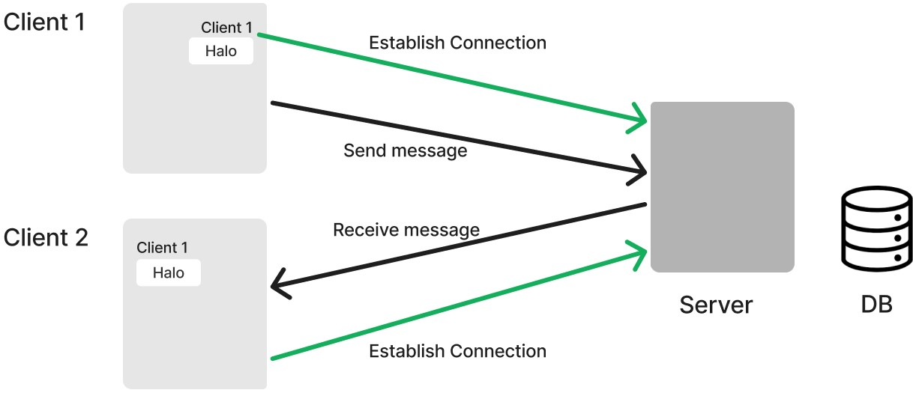</center><br>
Sedangkan pada websocket, client1 dan client2 akan terlebih dahulu membuat koneksi dengan server. Koneksi ini akan tetap terjaga hingga salah satu pihak memutus koneksi. Jadi ketika client1 mengirim chat baru ke server, server dapat langsung mengirim chat tersebut ke client2 melalui koneksi yang telah dibangun. Dengan begitu, client2 tidak perlu meminta data baru secara terus menerus.
Secara lebih detail, perbedaan websocket dan REST API dapat dilihat pada tabel berikut:<br>
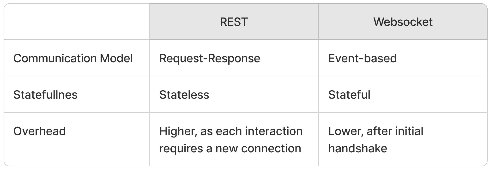<br>

### Bagaimana koneksi websocket terbentuk
Untuk membuat koneksi websocket, klien dan server perlu melakukan handshake sebagai setup awal. Pada proses ini, klien akan mengirimkan HTTP request untuk meminta koneksi websocket. Response HTTP 101 switching protocol akan diberikan server kepada klien jika koneksi berhasil dibuat. Selanjutnya komunikasi antara klien dan server dapat dilakukan melalui saluran full-duplex websocket. Proses pembentukan koneksi dapat terlihat pada ilustrasi berikut:<br>
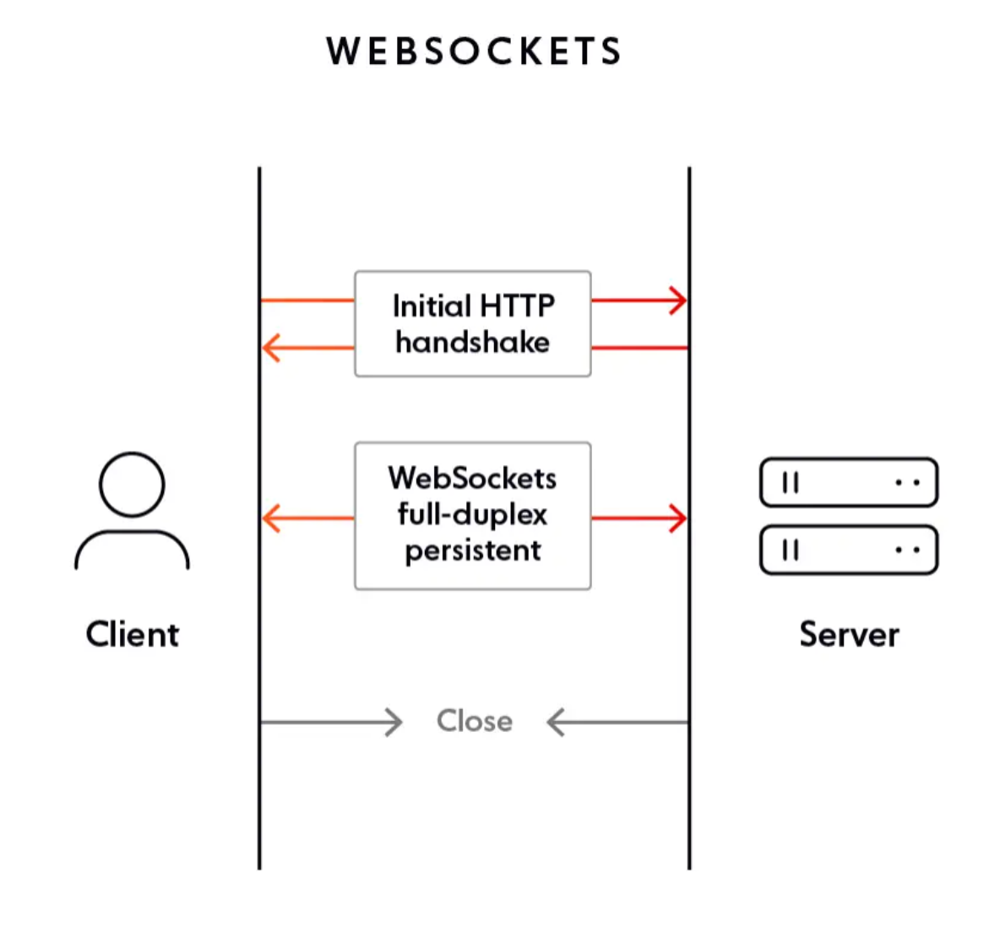<br>

## Membangun aplikasi chat realtime dengan socket io
Kali ini, kita akan mencoba menerapkan websocket dengan membuat aplikasi chat realtime menggunakan library socket.io. Kalian dapat mengikuti materi ini dengan menggunakan kode yang ada pada direktori [code](code).

### Integrasi websocket
Sebelum masuk ke pembuatan aplikasi, kita akan mencoba mengintegrasikan websocket di sisi klien dan server terlebih dahulu. Ketika membuat [socket.io](https://socket.io/docs/v4/) server, kita memerlukan http server untuk menangani koneksi websocket. Seperti yang sudah dijelaskan sebelumnya, websocket perlu melakukan HTTP handshake sebelum memulai koneksi websocketnya. Di sini, kita akan menggunakan `express` lagi sebagai http server.
1. Install librarry express dengan command `npm i express` dan socket.io dengan command `npm i socket.io`
2. Pada sisi server, tuliskan kode berikut pada `server.js`:
    ```R
    const express = require('express');
    const { createServer } = require('node:http');
    const { join } = require('node:path');
    const {Server} = require('socket.io')

    const app = express();
    const server = createServer(app);
    const io = new Server(server);

    let numUsers = 0;

    app.use(express.static(join(__dirname, "public")));

    io.on('connection', (socket) => {
        let addedUser = false;
        let rooms = [];
    })

    server.listen(3000, () => {
        console.log('server running at http://localhost:3000');
    });
    ```
    - Pada baris ke-4, kita mengimport class `Server` dari library socket.io
    - Pada baris ke-8, kita membuate instance socket.io server baru
    - Pada baris 14-17, kita membuat listener untuk event `connection` 
3. Pada sisi klien, buat instance io() dengan menambahkan kode berikut pada `public/client.js`
    ```R
    const socket = io()
    ```
    - fungsi io() sudah tersedia karena kita telah menambahkan `<script src="/socket.io/socket.io.js"></script>` pada file `public/index.html`
4. Jalankan server dengan command `npm run start` lalu akses `localhost:3000` pada web browser<br>
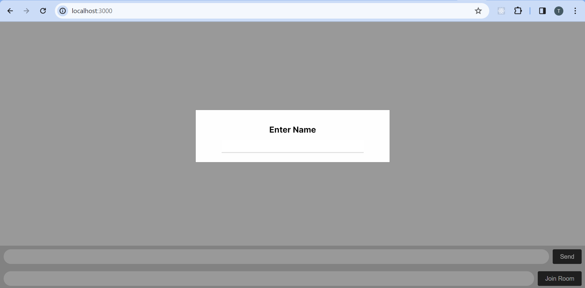
5. Pada terminal, akan terlihat klien yang terkoneksi beserta socket id-nya<br>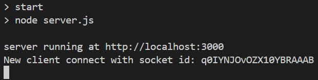

### Menambah user
Pada websocket, komunikasi antara klien dan server mengikuti konsep `event-driven`, di mana komunikasi terjadi berdasarkan kejadian atau peristiwa. Pada socket.io, kita dapat membuat event dengan fungsi `socket.emit()` dan membuat listenernya dengan fungsi `socket.on()`. Event ini dapat terjadi di klien maupun server. Jika event sebagai pemicu komunikasi berada di klien, maka kita perlu membuat listenernya di server, begitupun sebaliknya. Saat ini, kita akan membuat event pertama yaitu `new user`.
1. Buat event `new user` pada sisi klien ketika terjadi submit pada form input nama dengan menambahkan kode berikut pada `public/client.js`:
    ```R
    nameForm.addEventListener("submit", (e) => {
        e.preventDefault();

        if(nameInput.value) {
            username = nameInput.value;
            socket.emit("new user", {"username": nameInput.value, "room": room});
            addNotificationMessage("You are join to global room", room);
            nameInput.value = "";
            nameModal.style.display = "none";
        }
    })
    ```
2. Buat listener untuk menanggapi event `new user` pada server dengan menambahkan kode berikut pada `server.js`, letakkan kode ini di dalan `io.on('connection', (socket) => {})`:
    ```R
    socket.on("new user", (data) => {
        if (addedUser) return;

        // add username to socket session
        socket.username = data.username;
        numusers +=1;
        addedUser = true;

        // add to user list
        users.push({"username": data.username});
        socket.broadcast.emit("new user", {"username": data.username, "room": data.room});
    });
    ```
    Pada kode tersebut, server juga melakukan broadcast event `new user` untuk mengirim data pengguna baru kepada pengguna aktif lainnya.
3. Selanjutnya, kita perlu membuat event listener `new user` pada klien dengan menambahkan kode berikut pada `client.js`
    ```R
    socket.on("new user", (data) => {
        addNotificationMessage(data.username + " joined", data.room);
    });
    ```
4. Akses kembali `localhost:3000` pada dua browser, lalu isi username.<br>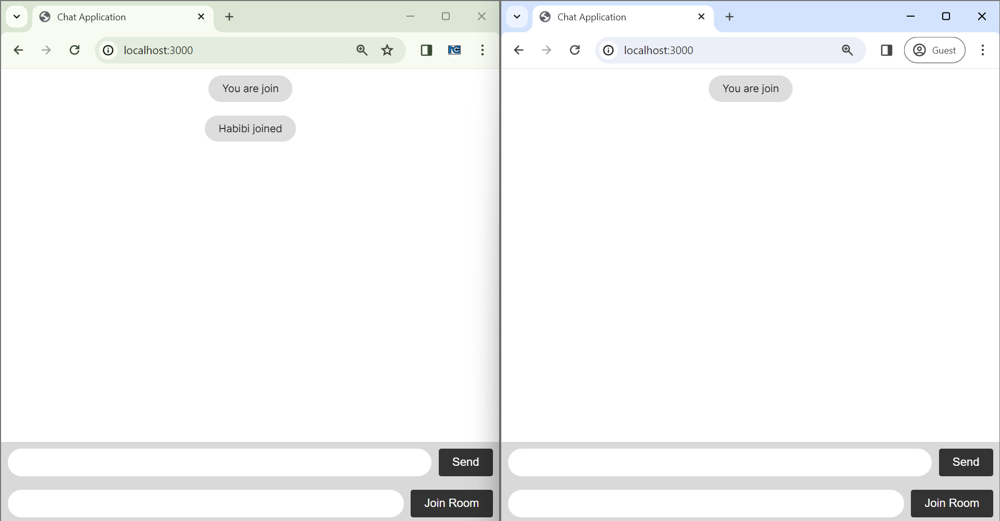

### Bergabung ke room dan mengirim pesan
Selanjutnya, kita akan membuat event `chat message` untuk melakukan pengiriman pesan. Disini, klien dapat menentukan mau mengirim pesan ke mana. Hal ini dapat dilakukan dengan mengimplementasikan `room` pada socket.io. Pada implementasinya, room merupakan suatu struktur data map dengan key berupa nama room dan valuenya berupa kumpulan socket.id yang tergabung dalam room tersebut.
1. Buat event `join room` dan `chat message` pada `public/client.js` dengan menambahkan kode berikut:
    ```R
    // submit new message
    messageForm.addEventListener("submit", (e) => {
        e.preventDefault();
        
        if (messageInput.value) {
            addOwnMessage(messageInput.value, room);
            socket.emit("chat message", {"sender": username, "message": messageInput.value, "room": room});
            messageInput.value = '';
        }
    });

    // enter a room
    roomForm.addEventListener("submit", (e) => {
        e.preventDefault();

        if (roomInput.value) {
            socket.emit("join room", {"user": username, "room": roomInput.value});
            createRoomMessages(roomInput.value);
            changeRoomMessage(room, roomInput.value);
            room = roomInput.value;
            roomInput.value = "";
        }
        else {
            changeRoomMessage(room, roomInput.value);
            room = roomInput.value;
        }
    });
    ```
2. Pada server, tambahkan listener untuk event `join room` dan `chat message` seperti berikut:
    ```R
    socket.on('chat message', (data) => {
        chatData = {
            "sender": data.sender,
            "message": data.message,
            "room": data.room
        }
        if (data.room === "") {
            socket.broadcast.emit('new message', chatData);
        }
        else {
            socket.to(data.room).emit("new message", chatData);
        }
    });

    socket.on("join room", (data) => {
        socket.join(data.room);
        rooms.push(data.room);
    })
    ```
    - Untuk bergabung ke dalam room, dapat digunakan `socket.join()`, socket.io akan otomatis membuat room baru jika belum ada
    - Server melakukan pengiriman pesan ke klien lain yang dituju dengan dengna melakukan emit event `new message`
    - Pada baris ke-11, kita tidak menggunakan `broadcast`, melainkan `to(data.room)` untuk mengirim pesan ke klien tertentu saja.
3. Selanjutnya, tambahkan listener `new message` pada `public/client.js`:
    ```R
    socket.on('new message', (data) => {
        addOtherMessage(data.message, data.sender, data.room);
    });
    ```
4. Sekarang, kita telah dapat berbagung ke suatu `room` dan melakukan pengiriman pesan sesuai `room` yang dituju<br>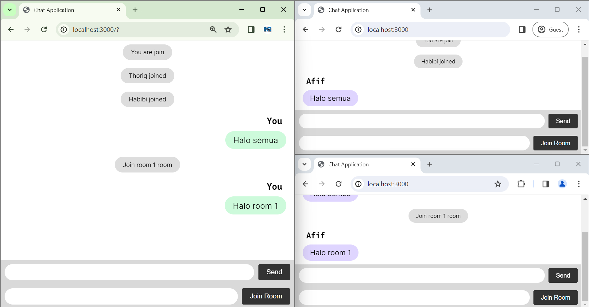

### disconnect event
Selanjutnya, kita akan memberikan notifikasi untuk tiap klien yang terputus dari koneksi. Ketika suatu klien terputus dari koneksi, akan ada event `disconnect` yang dapat ditangkap oleh server. Selanjutnya, server dapat melakukan broadcast ke seluruh klien lain terkait untuk memberikan notifikasi tersebut.
1. Buat listener `disconnect` pada `server.js` sebagai berikut:
    ```R
    socket.on("disconnect", () => {
        if(addedUser) {
        numusers -= 1;

        rooms.forEach((room) => {
            socket.broadcast.emit("user leave", {
                "username": socket.username,
                "room": room 
            });
        });
        socket.broadcast.emit("user leave", {
            "username": socket.username,
            "room": "" 
        });
        }
    });
    ```
2. Lalu, buat listener untuk event `user leave` sebagai berikut:
    ```R
    socket.on("user leave", (data) => {
        addNotificationMessage(data.username + " leave", data.room);
    });
    ```
3. Maka ketika ada klien yang meninggalkan obrolan, terdapat notifikasi seperti berikut<br>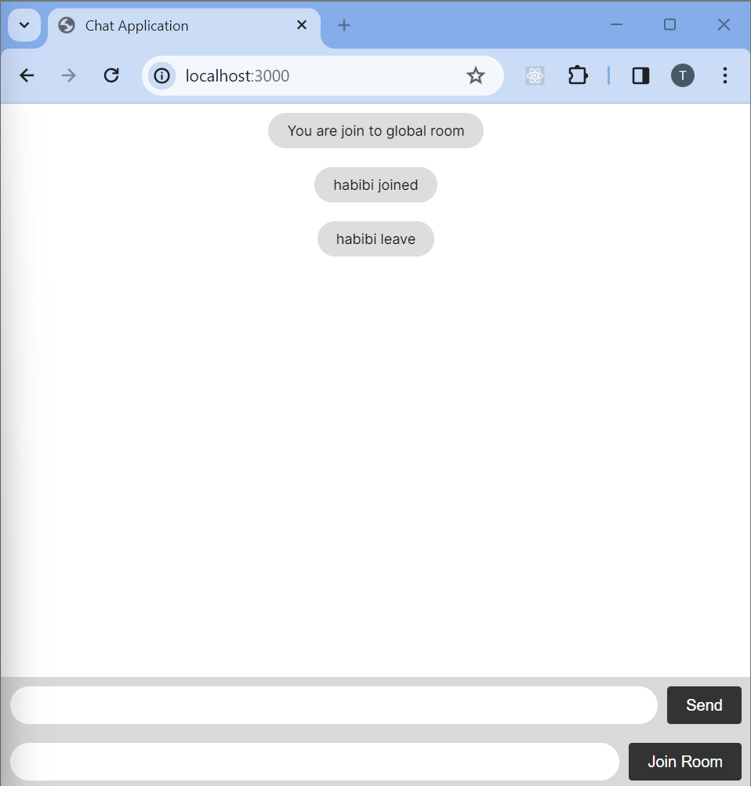

## Penugasan
Soon
